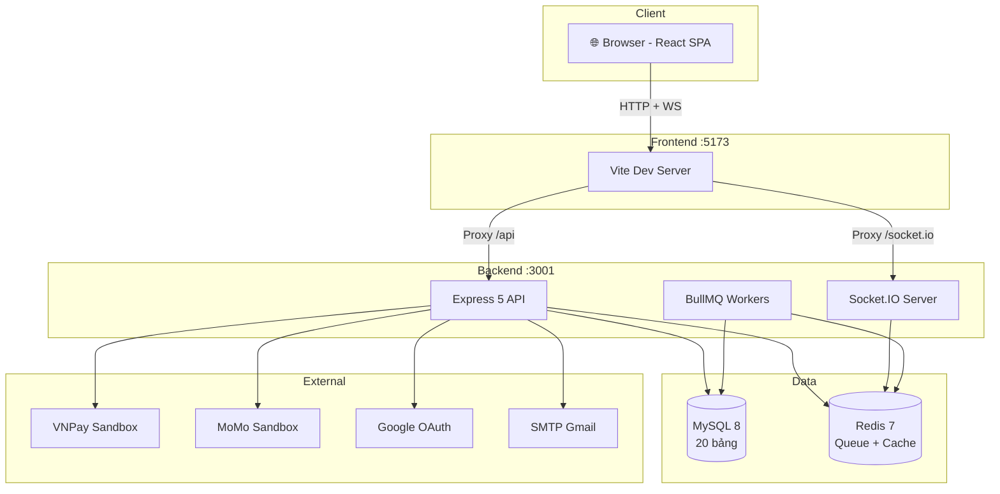
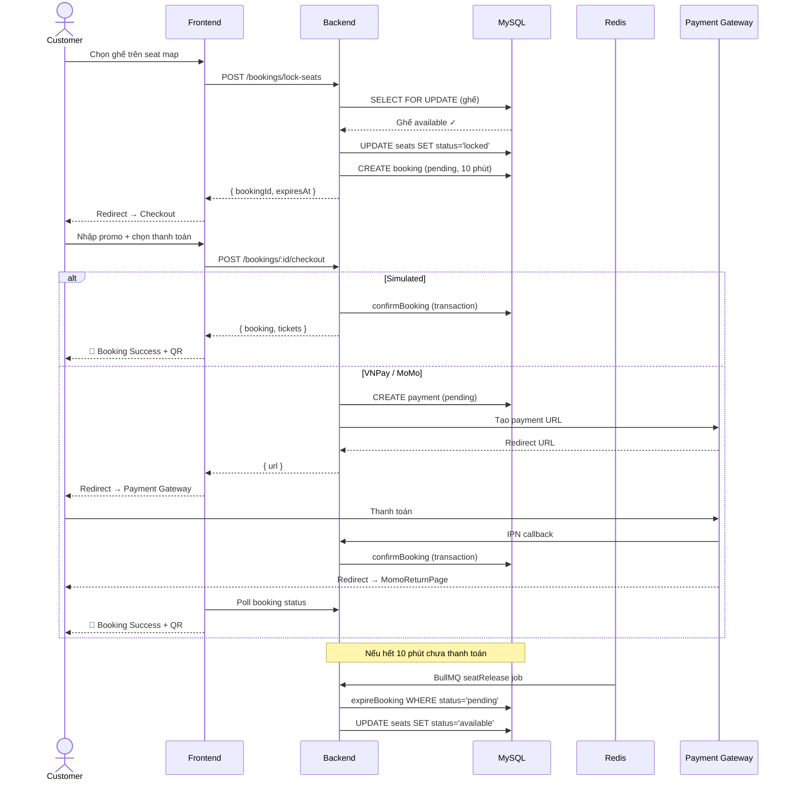
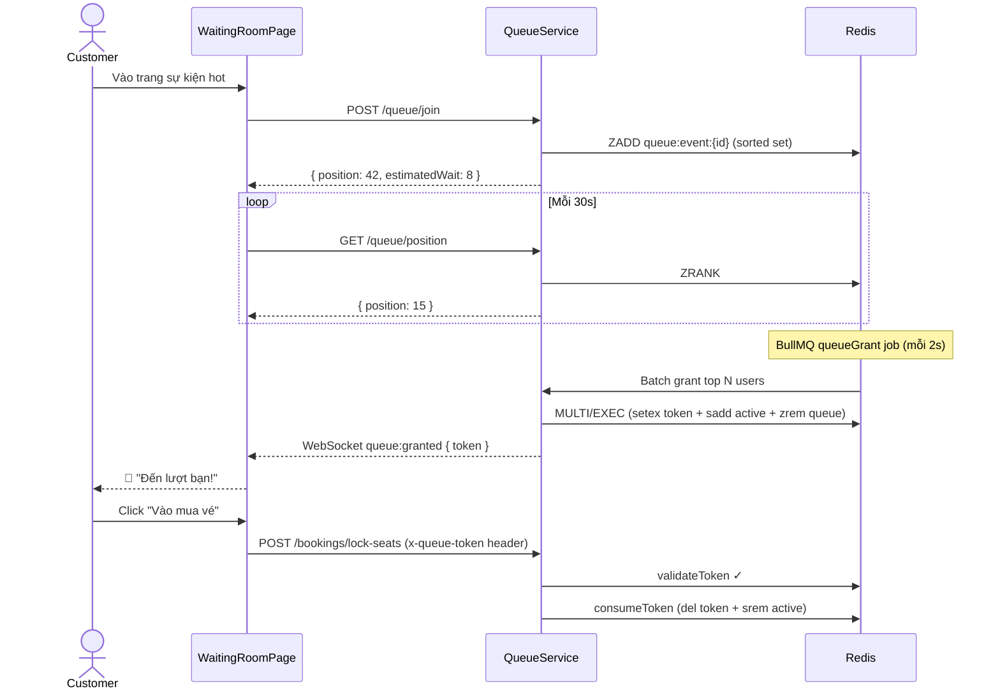
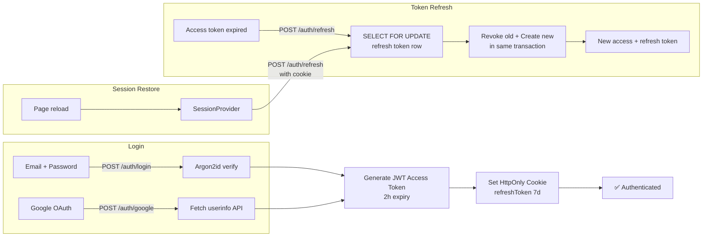
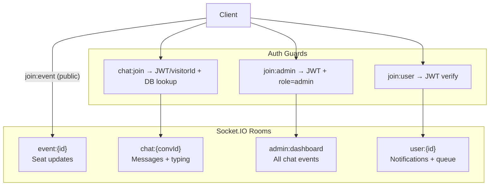

<div align="center">

# 🎫 Ticket Rush

**Nền tảng đặt vé sự kiện trực tuyến — Real-time Seat Map, Flash Sale Ready, Virtual Queue**

[](https://react.dev)
[](https://nodejs.org)
[](https://typescriptlang.org)
[](https://mysql.com)
[](https://redis.io)
[](https://socket.io)
[](https://tailwindcss.com)
[](LICENSE)

[Demo](#-cài-đặt--chạy) · [Tài liệu](#7-tài-liệu) · [Tech Stack](#2-tech-stack) · [Screenshots](#3-screenshots)

</div>

---

## 📋 Mục lục

1. [Tính năng](#1-tính-năng)
   - 1.1 [Customer](#11-customer)
   - 1.2 [Admin](#12-admin)
2. [Tech Stack](#2-tech-stack)
3. [Screenshots](#3-screenshots)
4. [Kiến trúc hệ thống](#4-kiến-trúc-hệ-thống)
   - 4.1 [System Architecture](#41-system-architecture)
   - 4.2 [Booking Flow](#42-booking-flow-core-business-logic)
   - 4.3 [Virtual Queue Flow](#43-virtual-queue-flow)
   - 4.4 [Authentication Flow](#44-authentication-flow)
   - 4.5 [WebSocket Architecture](#45-real-time-websocket-architecture)
   - 4.6 [Key Technical Decisions](#46-key-technical-decisions)
5. [Cấu trúc dự án](#5-cấu-trúc-dự-án)
6. [Cài đặt & Chạy](#6-cài-đặt--chạy)
   - 6.1 [Yêu cầu](#61-yêu-cầu)
   - 6.2 [Clone & cài đặt](#62-clone--cài-đặt)
   - 6.3 [Cấu hình environment](#63-cấu-hình-environment)
   - 6.4 [Database setup](#64-database-setup)
   - 6.5 [Chạy development](#65-chạy-development)
   - 6.6 [Tài khoản test](#66-tài-khoản-test-sau-khi-seed)
   - 6.7 [Test VNPay sandbox](#67-test-vnpay-sandbox)
   - 6.8 [Cài Redis trên Windows](#68-cài-redis-trên-windows)
   - 6.9 [Setup ngrok](#69-setup-ngrok-cho-vnpay-ipn--momo-redirect)
   - 6.10 [Setup Google OAuth](#610-setup-google-oauth)
   - 6.11 [Setup SMTP](#611-setup-smtp-gmail)
   - 6.12 [Setup VNPay Sandbox](#612-setup-vnpay-sandbox)
   - 6.13 [Setup MoMo Sandbox](#613-setup-momo-sandbox)
   - 6.14 [Setup Turnstile CAPTCHA](#614-setup-cloudflare-turnstile-captcha)
   - 6.15 [Troubleshooting](#615-troubleshooting)
7. [Tài liệu](#7-tài-liệu)
8. [API Documentation](#8-api-documentation)
   - 8.1 [Modules chính](#81-modules-chính)
   - 8.2 [WebSocket Events](#82-websocket-events)
9. [Scripts](#9-scripts)
   - 9.1 [Frontend](#91-frontend)
   - 9.2 [Backend](#92-backend)
10. [Tiêu chí chấm điểm](#10-tiêu-chí-chấm-điểm)
11. [Nhóm thực hiện](#11-nhóm-thực-hiện)

---

## 1. Tính năng

### 1.1 Customer

| # | Tính năng | Mô tả |
|---|-----------|-------|
| 1 | **Tìm kiếm sự kiện** | Autocomplete, filter theo thể loại / ngày / giá, sắp xếp |
| 2 | **Sơ đồ ghế real-time** | Interactive seat map, WebSocket live update, pinch zoom mobile |
| 3 | **Đặt vé + giữ chỗ** | Pessimistic locking (SELECT FOR UPDATE), timeout 10 phút |
| 4 | **Thanh toán** | VNPay sandbox, MoMo sandbox, thanh toán mô phỏng |
| 5 | **Vé QR Code** | Signed JWT, download PDF, admin scan verify |
| 6 | **Virtual Queue** | Hàng chờ ảo khi traffic cao, Redis sorted set, BullMQ batch grant |
| 7 | **Mã giảm giá** | Validate + apply promo, per-user limit, event-scoped |
| 8 | **Yêu thích** | Toggle favorite, danh sách yêu thích |
| 9 | **Thông báo** | Real-time WebSocket + email notifications |
| 10 | **Đa ngôn ngữ** | Tiếng Việt / English (react-i18next) |
| 11 | **Live Chat** | Chat widget, typing indicator, read receipts, recall messages |
| 12 | **Google OAuth** | Đăng nhập bằng Google account |
| 13 | **Dark/Light mode** | Theme toggle, persistent preference |

### 1.2 Admin

| # | Tính năng | Mô tả |
|---|-----------|-------|
| 1 | **Dashboard** | Real-time: doanh thu, tỉ lệ lấp đầy, demographics, conversion funnel |
| 2 | **Quản lý sự kiện** | CRUD wizard 5 bước + seat map builder + clone event |
| 3 | **Quản lý user** | Danh sách, chi tiết, ban/unban, booking history |
| 4 | **Quản lý booking** | Tìm kiếm, filter, refund |
| 5 | **Mã giảm giá** | CRUD, bulk actions, usage tracking |
| 6 | **Venues** | CRUD địa điểm tổ chức |
| 7 | **Export báo cáo** | CSV export với filter theo ngày |
| 8 | **Audit logs** | Lịch sử thao tác admin, search + filter |
| 9 | **Live Chat** | Quản lý conversations, bulk actions, typing indicator |

---

## 2. Tech Stack

| Layer | Công nghệ |
|-------|-----------|
| **Frontend** | React 19, Vite 6, TypeScript, TailwindCSS 4, Redux Toolkit (RTK Query), React Router 7, Framer Motion, Socket.IO Client, react-i18next, react-hook-form, Zod |
| **Backend** | Node.js 22, Express 5, TypeScript, Sequelize 6 (MySQL), Redis 7 (ioredis), BullMQ, Socket.IO 4, Passport (Google OAuth), Nodemailer, Multer |
| **Database** | MySQL 8, Redis 7 |
| **Payment** | VNPay sandbox, MoMo sandbox |
| **Testing** | Jest + Supertest (BE), Vitest (FE) |
| **Security** | Argon2id hashing, JWT (access + refresh rotation), HMAC-SHA512, rate limiting, CAPTCHA |
| **Design** | Glassmorphism 2.0, responsive (mobile-first), dark/light mode |

---

## 3. Screenshots

> *Thêm screenshots vào thư mục `docs/screenshots/` và cập nhật ở đây*

---

## 4. Kiến trúc hệ thống

### 4.1 System Architecture



### 4.2 Booking Flow (Core Business Logic)



### 4.3 Virtual Queue Flow



### 4.4 Authentication Flow



### 4.5 Real-time WebSocket Architecture



### 4.6 Key Technical Decisions

- **Pessimistic Locking**: `SELECT FOR UPDATE` cho seat booking — chống race condition
- **Token Rotation**: Refresh token với `LOCK.UPDATE` trong transaction — chống dual-consumption
- **Virtual Queue**: Redis sorted set + MULTI/EXEC atomic batch grant
- **VNPay Integration**: Custom `sortObject` với `encodeURIComponent` + `%20→+` matching VNPay spec
- **Real-time**: Socket.IO rooms cho event seats, chat, notifications
- **BullMQ Jobs**: Seat release, email sender, event transition, queue grant, data cleanup

---

## 5. Cấu trúc dự án

```
TicketRush/
├── frontend/                    # React SPA
│   ├── src/
│   │   ├── app/                 # Router, store, providers, SessionProvider
│   │   ├── features/            # Feature-based modules
│   │   │   ├── auth/            # Login, register, Google OAuth
│   │   │   ├── booking/         # Seat selection, checkout, success
│   │   │   ├── chat/            # Chat widget + services
│   │   │   ├── events/          # Event list, detail, seat map
│   │   │   ├── admin/           # Admin dashboard, management pages
│   │   │   ├── landing/         # Homepage components
│   │   │   ├── queue/           # Virtual queue waiting room
│   │   │   ├── tickets/         # My tickets, QR display
│   │   │   ├── user/            # Profile, avatar upload
│   │   │   ├── favorites/       # Favorite events
│   │   │   ├── notifications/   # Notification services
│   │   │   └── static/          # About, FAQ, Contact, Privacy, Terms
│   │   ├── shared/              # Hooks, utils, components, constants
│   │   ├── layouts/             # MainLayout, AdminLayout, AuthLayout
│   │   └── locales/             # i18n (vi/en)
│   ├── public/                  # Static assets
│   └── .env.example             # Template biến môi trường
│
├── backend/                     # Express API
│   ├── src/
│   │   ├── modules/             # Feature modules
│   │   │   ├── auth/            # JWT, Google OAuth, password reset
│   │   │   ├── booking/         # Lock seats, checkout, confirm
│   │   │   ├── payments/        # VNPay, MoMo integration
│   │   │   ├── tickets/         # QR verify, PDF export
│   │   │   ├── events/          # Public event queries
│   │   │   ├── admin/           # Admin CRUD, reports, audit
│   │   │   ├── chat/            # Live chat routes
│   │   │   ├── queue/           # Virtual queue service
│   │   │   ├── promo/           # Promo code management
│   │   │   ├── users/           # Profile, avatar upload
│   │   │   ├── notifications/   # Notification CRUD
│   │   │   └── email/           # Email service (Nodemailer)
│   │   ├── jobs/                # BullMQ background jobs (5)
│   │   ├── models/              # Sequelize models (18)
│   │   ├── migrations/          # DB migrations (20)
│   │   ├── seeders/             # Sample data
│   │   ├── middleware/          # Auth, validation, rate limit, CAPTCHA
│   │   ├── config/              # DB, Redis, Socket.IO, env
│   │   └── utils/               # Logger, API response helpers
│   ├── uploads/                 # User avatar uploads
│   └── .env.example             # Template biến môi trường
│
├── docs/                        # Tài liệu kỹ thuật (9 files)
├── .gitignore                   # Git ignore rules
├── CLAUDE.md                    # Project instructions cho Claude Code
├── DESIGN.md                    # Design system
├── CONTEXT.md                   # Đề bài gốc
└── README.md
```

---

## 6. Cài đặt & Chạy

### 6.1 Yêu cầu

| Phần mềm | Phiên bản | Link tải |
|-----------|-----------|----------|
| **Node.js** | 22 LTS | [nodejs.org/download](https://nodejs.org/en/download) |
| **XAMPP** | 8.x (MySQL 8) | [apachefriends.org](https://www.apachefriends.org/download.html) |
| **Redis** | 7.x | [GitHub Windows port](https://github.com/tporadowski/redis/releases) |
| **Git** | 2.x+ | [git-scm.com](https://git-scm.com/download/win) |

**Kiểm tra sau khi cài:**
```bash
node -v      # v22.x.x
mysql --version  # hoặc mở XAMPP → Start MySQL
redis-cli ping   # PONG
git --version
```

### 6.2 Clone & cài đặt

```bash
git clone <repo-url>
cd TicketRush

# Frontend
cd frontend && npm install

# Backend
cd ../backend && npm install
```

### 6.3 Cấu hình environment

**`backend/.env`**
```env
# Database
DB_HOST=localhost
DB_PORT=3306
DB_NAME=ticketrush
DB_USER=root
DB_PASSWORD=

# Redis
REDIS_HOST=localhost
REDIS_PORT=6379

# JWT
JWT_ACCESS_SECRET=<random-string-32-chars>
JWT_REFRESH_SECRET=<random-string-32-chars>
QR_SECRET=<random-string-32-chars>

# Google OAuth
GOOGLE_CLIENT_ID=<from-google-cloud-console>
GOOGLE_CLIENT_SECRET=<from-google-cloud-console>

# SMTP (Gmail App Password)
SMTP_HOST=smtp.gmail.com
SMTP_PORT=587
SMTP_USER=<your-email>
SMTP_PASS=<16-char-app-password>

# VNPay Sandbox
VNPAY_TMN_CODE=<from-vnpay-sandbox>
VNPAY_HASH_SECRET=<from-vnpay-sandbox>
VNPAY_URL=https://sandbox.vnpayment.vn/paymentv2/vpcpay.html

# MoMo Sandbox
MOMO_PARTNER_CODE=MOMO
MOMO_ACCESS_KEY=F8BBA842ECF85
MOMO_SECRET_KEY=K951B6PE1waDMi640xX08PD3vg6EkVlz
MOMO_ENDPOINT=https://test-payment.momo.vn/v2/gateway/api/create

# URLs
API_URL=http://localhost:3001
CLIENT_URL=http://localhost:5173
```

**`frontend/.env`**
```env
VITE_GOOGLE_CLIENT_ID=<same-as-backend>
VITE_TURNSTILE_SITE_KEY=<from-cloudflare>
```

### 6.4 Database setup

```bash
# Tạo database "ticketrush" trong phpMyAdmin hoặc CLI
cd backend
npx sequelize-cli db:migrate
npx sequelize-cli db:seed:all
```

### 6.5 Chạy development

```bash
# Terminal 1 — Backend (port 3001)
cd backend && npm run dev

# Terminal 2 — Frontend (port 5173)
cd frontend && npm run dev
```

### 6.6 Tài khoản test (sau khi seed)

| Role | Email | Password |
|------|-------|----------|
| **Admin** | `admin@ticketrush.vn` | `Admin@12345` |
| **Customer** | `user@ticketrush.vn` | `User@12345` |

### 6.7 Test VNPay sandbox

| Field | Giá trị |
|-------|---------|
| Ngân hàng | NCB |
| Số thẻ | `9704198526191432198` |
| Tên chủ thẻ | `NGUYEN VAN A` |
| Ngày phát hành | `07/15` |
| Mật khẩu OTP | `123456` |

### 6.8 Cài Redis trên Windows

Redis không có bản chính thức cho Windows. Dùng 1 trong 3 cách:

**Cách 1 — Tải bản port từ GitHub (đơn giản nhất):**
```bash
# Tải từ: https://github.com/tporadowski/redis/releases
# Giải nén → chạy redis-server.exe
redis-server.exe

# Test:
redis-cli ping   # → PONG
```

**Cách 2 — Memurai (Redis-compatible cho Windows):**
```bash
# Tải từ: https://www.memurai.com/
# Cài xong tự chạy như Windows service
```

**Cách 3 — WSL2/Docker:**
```bash
# WSL2
wsl --install
wsl -d Ubuntu
sudo apt update && sudo apt install redis-server
sudo service redis-server start

# Docker
docker run -d --name redis -p 6379:6379 redis:7-alpine
```

> Nếu không có Redis, app vẫn chạy nhưng Virtual Queue + BullMQ jobs sẽ không hoạt động.

### 6.9 Setup ngrok (cho VNPay IPN + MoMo redirect)

VNPay IPN và MoMo cần gọi về server qua URL public. Dùng **ngrok** để tunnel localhost:

```bash
# 1. Cài ngrok
winget install ngrok.ngrok          # Windows
# hoặc tải tại https://ngrok.com/download

# 2. Đăng ký free account + lấy authtoken
#    https://dashboard.ngrok.com/signup
ngrok config add-authtoken <your-token>

# 3. Tunnel backend
ngrok http 3001
# Output: https://abc123.ngrok-free.app → http://localhost:3001
```

Sau đó cập nhật `backend/.env`:
```env
API_URL=https://abc123.ngrok-free.app
CLIENT_URL=http://localhost:5173      # frontend vẫn localhost
```

Cấu hình VNPay IPN URL trong merchant portal:
```
https://abc123.ngrok-free.app/api/payments/vnpay/ipn
```

> **Lưu ý**: Mỗi lần restart ngrok sẽ đổi URL → cần update `.env` + restart backend.

### 6.10 Setup Google OAuth

1. Vào [Google Cloud Console](https://console.cloud.google.com) → tạo project
2. **APIs & Services → OAuth consent screen** → External → điền App name + email → Save
3. **Credentials → Create Credentials → OAuth client ID**
   - Type: **Web application**
   - Authorized JavaScript origins: `http://localhost:5173`
4. Copy **Client ID** → `backend/.env` (`GOOGLE_CLIENT_ID`) + `frontend/.env` (`VITE_GOOGLE_CLIENT_ID`)
5. Copy **Client Secret** → `backend/.env` (`GOOGLE_CLIENT_SECRET`)

### 6.11 Setup SMTP (Gmail)

1. [Google Account → Security](https://myaccount.google.com/security) → bật **2-Step Verification**
2. Vào **App passwords** → tạo password cho "Mail"
3. Copy 16 ký tự → `backend/.env` → `SMTP_PASS`
4. `SMTP_USER` = email Gmail của bạn

### 6.12 Setup VNPay Sandbox

1. Đăng ký: **https://sandbox.vnpayment.vn/devreg/** (tên website: TicketRush, URL: ngrok URL)
2. Nhận email → copy **TmnCode** + **HashSecret** → `backend/.env`
3. Login portal: **https://sandbox.vnpayment.vn/merchantv2/** → thêm IPN URL: `<ngrok>/api/payments/vnpay/ipn`

### 6.13 Setup MoMo Sandbox

MoMo public sandbox credentials (không cần đăng ký):
```env
MOMO_PARTNER_CODE=MOMO
MOMO_ACCESS_KEY=F8BBA842ECF85
MOMO_SECRET_KEY=K951B6PE1waDMi640xX08PD3vg6EkVlz
```
> MoMo redirect cần ngrok (không redirect về localhost). Xem [6.9](#69-setup-ngrok-cho-vnpay-ipn--momo-redirect).

### 6.14 Setup Cloudflare Turnstile (CAPTCHA)

1. [Cloudflare Dashboard](https://dash.cloudflare.com) → Turnstile → Add site (domain: `localhost`)
2. **Site Key** → `frontend/.env` → `VITE_TURNSTILE_SITE_KEY`
3. **Secret Key** → `backend/.env` → `TURNSTILE_SECRET_KEY`

> Bỏ qua bước này vẫn chạy được — CAPTCHA middleware skip khi key trống.

### 6.15 Troubleshooting

| Vấn đề | Giải pháp |
|--------|-----------|
| `EADDRINUSE :3001` | `netstat -ano \| findstr :3001` → `taskkill /F /PID <pid>` |
| Redis connection refused | Chạy `redis-server.exe` hoặc kiểm tra Memurai service |
| MySQL access denied | Kiểm tra `DB_USER` + `DB_PASSWORD` trong `.env`, mở XAMPP Control Panel |
| `SequelizeDatabaseError` | Chưa tạo DB hoặc chưa chạy migration: `npx sequelize-cli db:migrate` |
| VNPay "Sai chữ ký" | Kiểm tra `VNPAY_HASH_SECRET` đúng, restart backend |
| MoMo 503 | Cần ngrok, `API_URL` phải là URL public |
| Google OAuth 500 | Kiểm tra `GOOGLE_CLIENT_ID` cả backend + frontend `.env` |
| Logout khi reload | Clear cookies: DevTools → Application → Cookies → xóa `refreshToken` → login lại |
| Favicon cũ Vite tím | `Ctrl+Shift+R` hoặc Incognito tab |
| Website trắng trơn | Chạy `npm run build` → xem lỗi JSON parse trong locale files |

---

## 7. Tài liệu

| # | File | Nội dung |
|---|------|----------|
| 1 | [docs/plan.md](docs/plan.md) | Tổng quan, 4 phases triển khai, mapping tiêu chí |
| 2 | [docs/tech-stack.md](docs/tech-stack.md) | Danh sách công nghệ + lý do chọn |
| 3 | [docs/folder-structure.md](docs/folder-structure.md) | Cấu trúc thư mục frontend + backend |
| 4 | [docs/database.md](docs/database.md) | Schema 20 bảng, ERD, associations |
| 5 | [docs/api.md](docs/api.md) | 60+ API endpoints, WebSocket events |
| 6 | [docs/technical.md](docs/technical.md) | Giải pháp kỹ thuật: concurrency, queue, payments |
| 7 | [docs/pages.md](docs/pages.md) | 30+ frontend pages + responsive specs |
| 8 | [docs/security.md](docs/security.md) | Auth flow, OAuth2, rate limit, CAPTCHA, checklist |
| 9 | [docs/setup.md](docs/setup.md) | Hướng dẫn cài đặt chi tiết |
| 10 | [DESIGN.md](DESIGN.md) | Design system: glassmorphism, colors, components, animations |

---

## 8. API Documentation

Sau khi chạy backend: **[http://localhost:3001/api-docs](http://localhost:3001/api-docs)** (Swagger UI)

### 8.1 Modules chính

| Module | Prefix | Endpoints |
|--------|--------|-----------|
| Auth | `/api/auth` | Register, login, Google OAuth, refresh, logout, verify email, reset password |
| Events | `/api/events` | List, detail, seat map, featured, trending, suggestions, favorites |
| Booking | `/api/bookings` | Lock seats, checkout, cancel, request cancellation |
| Payments | `/api/payments` | VNPay create + return + IPN, MoMo create + IPN |
| Tickets | `/api/tickets` | My tickets, QR verify, PDF download |
| Chat | `/api/chat` | Conversations, messages, recall, read receipts |
| Queue | `/api/queue` | Join, position, validate token |
| Promo | `/api/promo` | Validate code |
| Admin | `/api/admin` | Dashboard, events, users, bookings, promos, venues, reports, audit logs |

### 8.2 WebSocket Events

| Event | Direction | Mô tả |
|-------|-----------|-------|
| `seat:bulk-updated` | Server → Client | Ghế thay đổi trạng thái real-time |
| `chat:message` | Bidirectional | Tin nhắn mới |
| `chat:typing` | Bidirectional | Typing indicator |
| `chat:messages_read` | Server → Client | Read receipts |
| `queue:position` | Server → Client | Cập nhật vị trí hàng đợi |
| `queue:granted` | Server → Client | Được cấp quyền vào mua vé |
| `notification:new` | Server → Client | Thông báo mới |
| `event:cancelled` | Server → Client | Sự kiện bị huỷ |

---

## 9. Scripts

### 9.1 Frontend

```bash
npm run dev        # Dev server (Vite, port 5173)
npm run build      # Production build
npm run preview    # Preview production build
npm run lint       # ESLint
```

### 9.2 Backend

```bash
npm run dev            # Dev server (nodemon, port 3001)
npm run build          # TypeScript compile
npm run start          # Production start
npm run test           # Jest + Supertest
npm run test:watch     # Jest watch mode
npm run db:migrate     # Chạy migrations
npm run db:migrate:undo # Rollback migration cuối
npm run db:seed        # Seed data mẫu
npm run db:seed:undo   # Xóa seed data
npm run db:reset       # Reset toàn bộ DB (undo + migrate + seed)
```

---

## 10. Tiêu chí chấm điểm

| # | Tiêu chí | Hệ số | Giải pháp trong dự án |
|---|----------|-------|-----------------------|
| 1 | Chức năng & features | 0.35 | 13 tính năng customer + 9 tính năng admin ([docs/plan.md](docs/plan.md)) |
| 2 | Thiết kế logic | 0.10 | Booking flow pessimistic lock, admin wizard, virtual queue |
| 3 | Giao diện đẹp, bản sắc | 0.20 | Glassmorphism 2.0, dark/light mode, responsive ([DESIGN.md](DESIGN.md)) |
| 4 | Hiệu năng | 0.10 | SPA + RTK Query cache, WebSocket real-time, lazy loading, code splitting |
| 5 | Phong cách lập trình | 0.05 | Feature-based FE, MVC backend, TypeScript strict, ESLint |
| 6 | Xử lý nhập liệu | 0.05 | Zod validation, phone mask, currency format, CAPTCHA |
| 7 | An ninh | 0.05 | Argon2id, JWT rotation, rate limit, XSS/CSRF protection ([docs/security.md](docs/security.md)) |
| 8 | URL routing | 0.05 | React Router nested routes, slug URLs, auth guards |
| 9 | ORM & DB independence | 0.05 | Sequelize ORM, 20 migrations, seeders |

---

## 11. Nhóm thực hiện

| Thành viên | MSSV | Vai trò |
|-----------|------|---------|
| ... | ... | ... |
| ... | ... | ... |
| ... | ... | ... |

---
